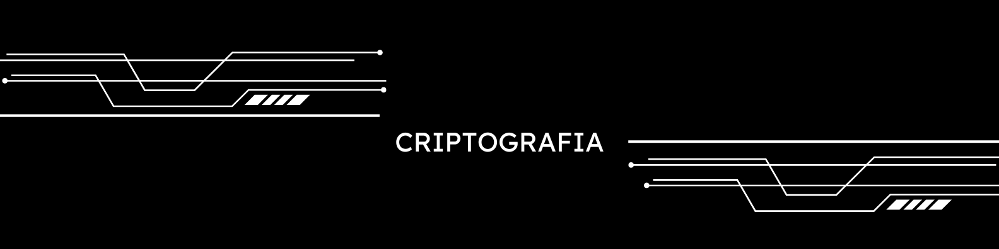

## CRIPTOGRAFIA - [Acesse aqui](https://criptografia-nine.vercel.app/)
> obs: utilize letras minúsculas e sem acentos para o resultado sair corretamente. Além disso,
> o projeto ainda aprensenta algumas funcionalidades pendentes, mas que serão resolvidas em breve ;)
### ÍNDICE

[Descrição](#descrição)
   
[Funcionalidades](#funcionalidades)
   
[Responsividade](#responsividade)
   
[Conclusão](#conclusão)

###  DESCRIÇÃO
  Visando a troca de informações codificadas entre o emissor e o receptor, este projeto foi desenvolvido no programa *One Next Education* (Oracle e Alura). É um meio muito interessante para enviar mensagens secretas ao seu amigo! (risos). Foi divertido desenvolvê-lo; aproveitei a liberdade que o programa dá, criei o meu próprio design e acrescentei algumas funções que serão explicadas posteriormente. Tenha um bom proveito!

###  FUNCIONALIDADES
  **Codificar e decodificar**: as vogais das sentenças serão substituídas por outro conjunto de letras, exemplo: a vogal "o" vira "ober" e a vogal "i" vira "imes". Se codificasse a palavra "livro", viraria "limesvrober". Para a decodificação, o processo seria o inverso, sacou? :). Consulte a tabela abaixo com as vogais e suas conversões:

Vogais   | Conversões
:---------: | :------:
a | ai
e | enter
i | imes
o | ober
u | ufat

A letra "e" é convertida para "enter"
A letra "i" é convertida para "imes"
A letra "a" é convertida para "ai"
A letra "o" é convertida para "ober"
A letra "u" é convertida para "ufat"

**Copiar**: essa função pode ser utilizada com o interesse de copiá-la, quem sabe, para enviar ou publicar em outro lugar (plataforma).

**Modo claro/escuro**: O site já vem na versão *dark mode* como padrão para preservar a sua visão, mas você pode mudar para o *light mode* tranquilamente; basta clicar no botão no canto superior direito.

**Caixa de e-mail**: 
> em breve

**Leitor de texto**: 
> em breve

**Idioma**: 
> em breve

###  RESPONSIVIDADE
  O site é responsivo, ou seja, ele se adapta de acordo com o dispositivo que você estiver utilizando. Ele é adaptável para mobile (celulares e alguns tipos de tablets), tablets e desktop (notebooks e computadores, em geral). Você verá como o sistema se comporta em cada dispositivo logo abaixo:

## 💻 Desktop
> em breve
## 📱 Mobile
> em breve
## 🔳 Tablet
> em breve

###  CONCLUSÃO
Isso é tudo, pessoal. Acredito que esta aplicação servirá ao seu devido fim (codificar e decodificar) e, quem sabe, poderá ser divertida. O projeto busca ser intuitivo e simples de usar, além de acessível a todos. Por fim, caso encontre algum bug, erro relacionado ao desempenho, design ou funcionamento do código, ou tenha uma sugestão de implementação, fique à vontade para me enviar. Analisarei a sua proposta! Tenha um bom dia, que Deus te abençoe.

      João 14:06
      Respondeu Jesus: "Eu sou o caminho, a verdade e a vida. Ninguém vem ao Pai, a não ser por mim.

 Desenvolvido por [iambel](https://github.com/iambel)
